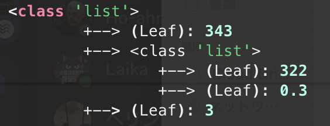
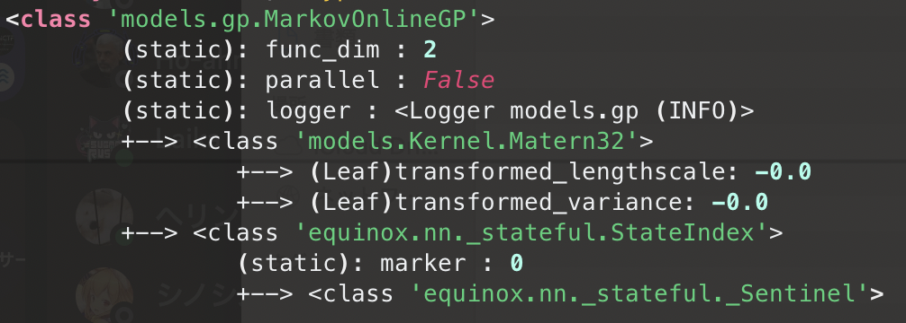

# PythonUtils
- 自分用のpythonライブラリですが、自由に使えます。

## 機能一覧
### utilpy
#### LapTime
- with構文内の実行時間を計測して表示します。
#### StringBuilder
- C#のStringBuilderをpythonで再現したクラスです。
### utilpy.jax
#### format_pytree
- オブジェクトをpytreeに分解して、木構造にフォーマットします。
  ```python
  import logging
  import utilpy.jax import format_pytree
  logger: logging.Logger = logging.getLogger(__name__)
  logger.info(format_pytree([343, [322, 0.3], 3]))
  ```
  
  
